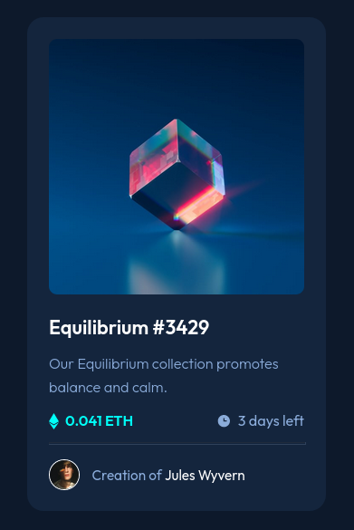
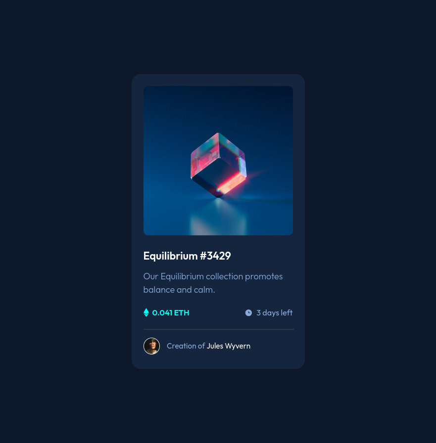

# Frontend Mentor - NFT preview card component solution

This is a solution to the [NFT preview card component challenge on Frontend Mentor](https://www.frontendmentor.io/challenges/nft-preview-card-component-SbdUL_w0U). Frontend Mentor challenges help you improve your coding skills by building realistic projects. 

## Table of contents

- [Overview](#overview)
  - [The challenge](#the-challenge)
  - [Screenshots](#screenshots)
  - [Links](#links)
- [My process](#my-process)
  - [Built with](#built-with)
  - [What I learned](#what-i-learned)
  - [Useful resources](#useful-resources)
- [Author](#author)
- [Acknowledgments](#acknowledgments)

## Overview

### The challenge

Users should be able to:

- View the optimal layout depending on their device's screen size. There are two layouts: mobile and desktop.
- See hover states for interactive elements.

### Screenshots



### Links

- Solution URL: [https://github.com/harnettd/nft-preview-card](https://github.com/harnettd/nft-preview-card)
- Live Site URL: [https://harnettd.github.io/nft-preview-card/](https://harnettd.github.io/nft-preview-card/)

## My process

### Built with

- HTML
- CSS
- Sass
- Flexbox
- Mobile-first workflow

### What I learned

In completing this challenge, I learned how to

- use the child combinator `>` to combine class selectors, *e.g.,*
```css
.image-wrapper:hover > .image-eye-wrapper {
  cursor: pointer;
  display: flex;
}
```

### Useful resources

- [mdn web docs: Child combinator](https://developer.mozilla.org/en-US/docs/Web/CSS/Child_combinator) - This is where I learned how to use the `>` combinator.

## Author

- Github - [Derek Harnett](https://github.com/harnettd)
- Frontend Mentor - [@harnettd](https://www.frontendmentor.io/profile/harnettd)

## Acknowledgments

- Thanks to [Frontend Mentor](https://www.frontendmentor.io/) for posting this challenge.
